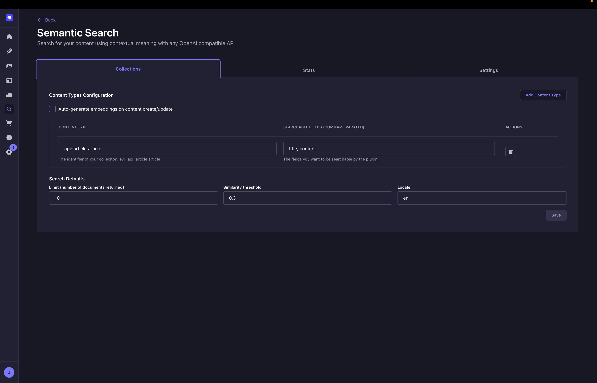
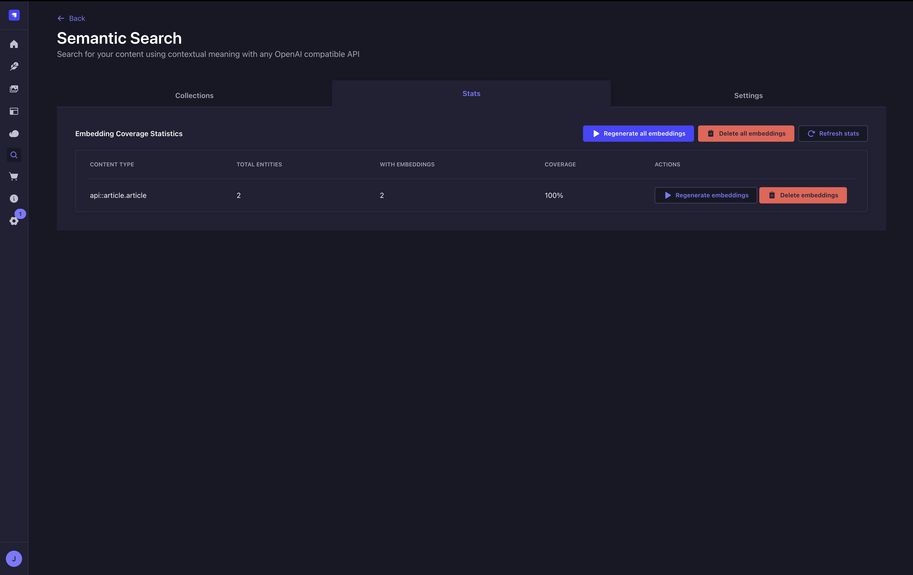
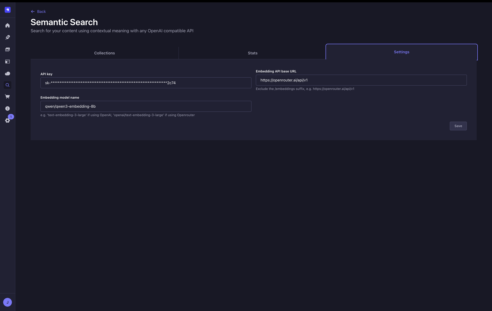
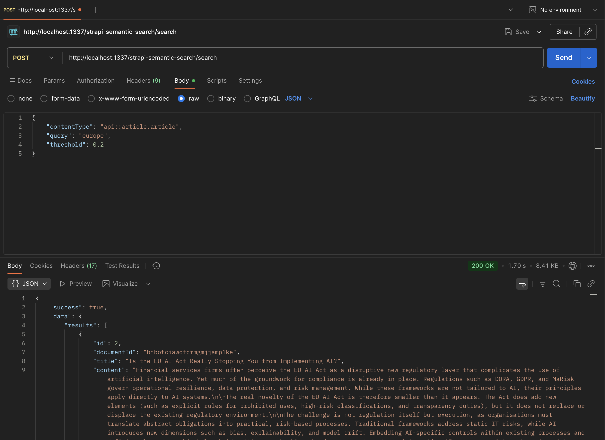

# Example screenshots

## Plugin configuration





## Plugin request and response



Example request

```json
{
  "contentType": "api::article.article",
  "query": "europe",
  "threshold": 0.2
}
```

Example response

```json
{
  "success": true,
  "data": {
    "results": [
      {
        "id": 2,
        "documentId": "bhbotciawctcrmgmjjamp1ke",
        "title": "Is the EU AI Act Really Stopping You from Implementing AI?",
        "content": "Financial services firms often perceive the EU AI Act as a disruptive new regulatory layer that complicates the use of artificial intelligence. Yet much of the groundwork for compliance is already in place. Regulations such as DORA, GDPR, and MaRisk govern operational resilience, data protection, and risk management. While these frameworks are not tailored to AI, their principles apply directly to AI systems.\n\nThe real novelty of the EU AI Act is therefore smaller than it appears. The Act does add new elements (such as explicit rules for prohibited uses, high-risk classifications, and transparency duties), but it does not replace or displace the existing regulatory environment.\n\nThe challenge is not regulation itself but execution, as organisations must translate abstract obligations into practical, risk-based processes. Traditional frameworks address static IT risks, while AI introduces new dimensions such as bias, explainability, and model drift. Embedding AI-specific controls within existing processes and defining clear ownership helps bridge this gap. Looking ahead, success depends on integrating AI governance into enterprise risk management to enable responsible scaling of AI across the organisation.\n\nRegulatory baseline: More familiar than it appears\nThe first lesson is that the EU AI Act does not arrive in a vacuum. Financial services firms already operate under highly regulated conditions. DORA enforces digital resilience, GDPR mandates data protection, and MaRisk governs risk management practices. These frameworks cover significant parts of what the AI Act requires, especially in terms of documentation, operational controls, and risk management.\n\nOrganisations should map AI-specific controls directly to these existing frameworks. This reduces redundancy and ensures that AI governance builds on familiar foundations rather than reinventing processes from scratch.\n\nClassification and the EU AI Act\nThe second lesson is that many organisations struggle with AI system classification. The EU AI Act introduces categories such as prohibited practices, high-risk systems, and transparency obligations, while distinguishing between the roles of providers and deployers. In financial services, most AI applications fall into low- or limited-risk classes, yet uncertainty arises in areas such as life and health underwriting or hiring, where classification determines the required level of control and oversight.\n\nHere, AI governance provides structure. It translates the EU AI Act into concrete rules by role and risk class. Each use case is classified, minimum controls are attached, and thresholds for “good enough” are established. This prevents over-engineering in low-risk use cases while ensuring robust safeguards for sensitive systems.\n\nRisk and quality management: Defining “good enough”\nA central barrier is the lack of clarity around what it means for AI to be “good enough.” Traditional risk management frameworks are strong in covering IT and operational risks but insufficient for AI-specific dimensions such as bias, explainability or model drift. This gap is one of the main reasons why organisations hesitate to put AI systems into production.\n\nAI quality management ensures that systems deliver reliable, safe, and reproducible results over time. It checks the integrity of data, the robustness of models, and the stability of operations. AI risk management, in turn, identifies potential failures—such as discriminatory outcomes, data misuse, or systemic errors—and defines safeguards to prevent or mitigate their impact.\n\nSince AI risks differ significantly by use case, a risk-based approach is essential. For example, when an AI system is used to determine the credit risk of individuals, it requires fairness testing, explainability features, defined thresholds for drift monitoring, and clear escalation procedures if metrics are breached. In contrast, when an AI system is used to extract information from incoming mail, it can be governed with a lighter set of controls, avoiding unnecessary overhead.\n\nBy calibrating controls to the risk of each use case, organisations can balance efficiency with sound management of risk and quality.\n\nBuild vs buy: Distinguishing roles\nAnother dimension is whether firms build or buy AI systems. Many organisations aim to develop proprietary models, yet in practice most AI in financial services is procured. The handling differs substantially. When building in-house models, firms must document data sources, model architecture, and validation results. When procuring AI systems from external providers, they must establish contractual safeguards, perform independent validation and verification, and define clear usage boundaries.\n\nApplying the same governance track to both scenarios risks creating mismatched expectations. A sound governance framework for procured AI systems ensures efficient implementation while mitigating vendor risk.\n\nConclusion: From compliance to scaling\nTaken together, these lessons highlight a central insight: the EU AI Act is not the primary barrier to AI adoption. The real challenge is execution—translating regulation into practice, embedding AI-specific risk and quality management into existing frameworks, and aligning safeguards with organisational risk appetite.\n\nOrganisations that put effective AI governance into practice do more than meet compliance requirements—they create the foundation for responsible AI adoption. The key question is no longer “Can we comply?” but “How do we scale AI responsibly?” Those that move early will be best positioned to expand their AI capabilities safely and with trust.\n\nHow we can support you\nSynpulse has hands-on experience in designing and implementing AI governance frameworks for leading financial institutions. We support clients across the full lifecycle of AI adoption:\n\nAssessing the AI landscape to identify potential regulatory exposure\nDesigning governance frameworks aligned with regulatory requirements\nEstablishing AI-specific risk and quality management aligned with the organisation's risk appetite\nImplementing governance through practical controls, templates, and training\nTalk to us to explore how tailored support can help you translate regulation into practice and scale AI responsibly.",
        "createdAt": "2026-01-29T09:42:45.737Z",
        "updatedAt": "2026-01-29T09:42:45.737Z",
        "publishedAt": "2026-01-29T09:42:45.747Z",
        "locale": null,
        "createdBy": {
          "id": 1,
          "documentId": "ndhoodep1he7f23hkkoe7ths",
          "firstname": "name",
          "lastname": null,
          "username": null,
          "email": "test@test.com",
          "password": "testpassword",
          "resetPasswordToken": null,
          "registrationToken": null,
          "isActive": true,
          "blocked": false,
          "preferedLanguage": null,
          "createdAt": "2026-01-29T09:00:02.692Z",
          "updatedAt": "2026-01-29T09:00:02.692Z",
          "publishedAt": "2026-01-29T09:00:02.692Z",
          "locale": null
        },
        "updatedBy": {
          "id": 1,
          "documentId": "ndhoodep1he7f23hkkoe7ths",
          "firstname": "test",
          "lastname": null,
          "username": null,
          "email": "test@test.com",
          "password": "testpassword",
          "resetPasswordToken": null,
          "registrationToken": null,
          "isActive": true,
          "blocked": false,
          "preferedLanguage": null,
          "createdAt": "2026-01-29T09:00:02.692Z",
          "updatedAt": "2026-01-29T09:00:02.692Z",
          "publishedAt": "2026-01-29T09:00:02.692Z",
          "locale": null
        },
        "localizations": [],
        "similarityScore": 0.2235
      }
    ],
    "metadata": {
      "query": "europe",
      "contentType": "api::article.article",
      "totalResults": 1,
      "threshold": 0.2
    }
  }
}
```
